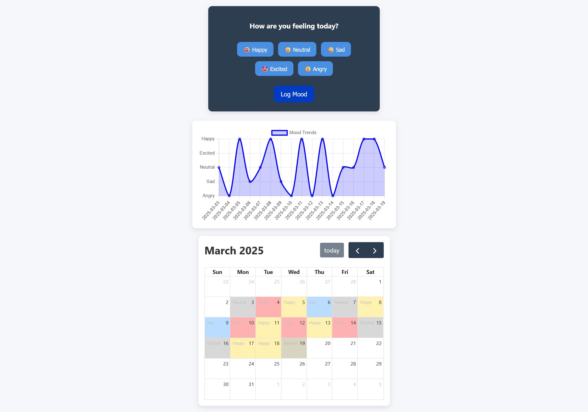

# Mood Tracker  

Mood Tracker is a simple yet functional web application that allows users to log their daily mood and visualize their emotional trends over time. With an intuitive interface and insightful visualizations, users can gain better self-awareness and track their mental well-being.  

---

## Table of Contents  

- [Features](#features)  
- [Demo](#demo)  
- [Screenshots](#screenshots)
- [Usage](#usage) 
- [Technologies Used](#technologies-used)
- [Credits](#credits)  
- [License](#license)  

---

## Features  

- **Daily Mood Logging:** Select and log your mood from predefined emoji options (Happy, Sad, Neutral, Excited, etc.).  
- **Persistent Storage:** Uses LocalStorage to save mood entries for future reference.  
- **Mood Visualization:** Displays past moods in a timeline and calendar view for daily, weekly, and monthly tracking.  
- **Responsive UI:** Works seamlessly on both mobile and desktop screens.  
- **Structured Codebase:** Clean, modular, and well-commented code for easy maintenance.  

---

## Demo  

To see the project in action, simply open `index.html` in your web browser.  

---

## Screenshots  
  

---

## Usage  

- **Log Your Mood:** Click on an emoji to log your mood for the day.  
- **View Past Moods:** Check your mood trends using the timeline and calendar view.  
- **Change Entries:** Modify past mood entries if needed.  

---

## Technologies Used  

- **HTML5:** Provides the structure of the web page.  
- **CSS3:** Handles styling and responsive design.  
- **JavaScript (ES6+):** Manages mood logging, data storage, and UI interactions.  
- **LocalStorage:** Ensures persistence of user mood logs.  
- **Chart.js:** Visualizes mood trends in a graphical format.  
- **FullCalendar.js:** Displays mood history in a calendar view.  

---

## Credits  

- **Open-Source Libraries:** Thanks to [Chart.js](https://www.chartjs.org/) and [FullCalendar.js](https://fullcalendar.io/) for visualization support.  

---

## License  

This project is open-source and available under the [MIT License](LICENSE).  
