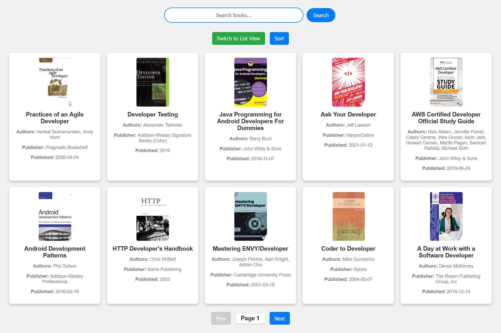
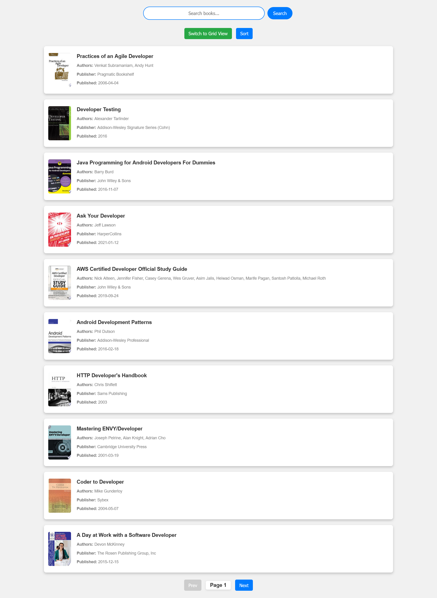

# 📚 Books Library  

A dynamic and responsive **Books Library** web application that fetches real-time book data from **FreeAPI.app** and displays it in a **user-friendly** way. Users can **search, sort, toggle views, and paginate** through books, making exploration smooth and effortless.  

---

## 📌 Table of Contents  

- [Features](#features)  
- [Live Demo](#live-demo)  
- [Screenshots](#screenshots)  
- [Installation](#installation)  
- [Usage](#usage)  
- [Technologies Used](#technologies-used)  
- [Project Structure](#project-structure)  
- [API Reference](#api-reference)  
- [License](#license)  

---

## Features  

✔ **Fetch Books from API** – Dynamically loads book data from **FreeAPI.app**.  
✔ **List & Grid View Toggle** – Users can switch between list and grid layouts.  
✔ **Detailed Book Information** – Displays title, author, publisher, published date, and thumbnail.  
✔ **Search Functionality** – Allows users to filter books by **title** or **author**.  
✔ **Sorting** – Users can sort books alphabetically by **title** or by **published date**.  
✔ **Pagination** – Loads more books automatically when scrolling.  
✔ **External Book Details** – Clicking on a book opens additional details in a new tab.  

---

## Live Demo  

🔗 **[View Deployment](https://mohdaffankhan.github.io/masterji-assignments/04_booksLibrary/index.html)**  

---

## Screenshots  

- **Grid View:**  
    

- **List View:**  
    

---

## Installation  

To run the project locally:  

1. **Clone the repository:**  
   ```sh
   git clone https://github.com/mohdaffankhan/masterji-assignments.git
   ```  
2. **Navigate to the project folder:**  
   ```sh
   cd masterji-assignments/04_booksLibrary
   ```  
3. **Open `index.html` in your browser:**  
   ```sh
   open index.html
   ```  

For a better experience, use a local web server.  

---

## Usage  

- **Fetch Books** – Books are loaded dynamically from the API.  
- **Toggle View** – Click the **View Toggle** button to switch between grid and list views.  
- **Search** – Use the search bar to filter books by **title** or **author**.  
- **Sort** – Sort books by **title** (A-Z) or **published date** (newest to oldest).  
- **Pagination** – Scroll to the bottom to load more books automatically.  
- **Book Details** – Click on a book to open its **detailed page** in a new tab.  

---

## Technologies Used  

- **HTML5** – Structuring the web application.  
- **CSS3** – Styling and responsive design.  
- **JavaScript (ES6+)** – Fetching API data, rendering content, and managing user interactions.  

---

## Project Structure  

```
📂 Books-Library
 ├── 📄 index.html        # Main HTML structure
 ├── 📄 style.css         # Styling and responsive design
 ├── 📄 script.js         # Core functionality (API calls, search, toggle, sort, pagination)
 ├── 📂 assets/           # Images & other assets
 ├── 📄 README.md         # Project documentation
```  

---

## API Reference  

📌 **API Endpoint:**  
```sh
GET https://api.freeapi.app/api/v1/public/books
```  
📌 **API Documentation:** [FreeAPI.app Guide](https://freeapi.hashnode.space/api-guide/apireference/getBooks)  

---

## License  

This project is open-source and available under the **MIT License**.  

---
