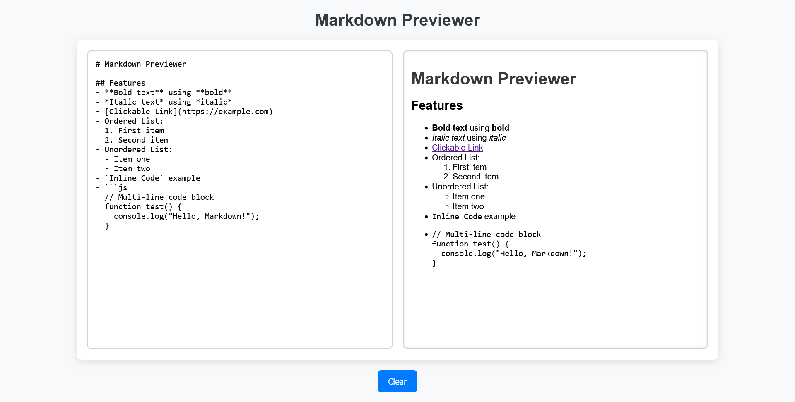

# 📝 Markdown Previewer  

A simple and responsive **Markdown Previewer** that allows users to type Markdown text and see the formatted output in real time. Built using **HTML, CSS, and JavaScript**, it leverages **marked.js** for Markdown parsing.

---

## 📌 Table of Contents  

- [Features](#features)  
- [Live Demo](#live-demo)  
- [Screenshots](#screenshots)  
- [Installation](#installation)  
- [Usage](#usage)  
- [Technologies Used](#technologies-used)  
- [Project Structure](#project-structure)  
- [Resources](#resources)  
- [License](#license)  

---

## Features  

✔ **Real-time Markdown Preview** – Converts Markdown input into formatted HTML instantly.  
✔ **Basic Markdown Support** – Handles headings, bold, italics, links, and lists.  
✔ **Clear Button** – Reset the editor with a single click.  
✔ **Responsive Design** – Works seamlessly on both mobile and desktop.  
✔ **BONUS**: Supports code blocks with syntax highlighting.  

---

## Live Demo  

🔗 **[View Deployment](https://mohdaffankhan.github.io/masterji-assignments/05_markdown-previewer/index.html)**  

---

## Screenshots  

- **Formatted Preview:**  
    

---

## Installation  

To run the project locally:  

1. **Clone the repository:**  
   ```sh
   git clone https://github.com/mohdaffankhan/masterji-assignments.git
   ```  
2. **Navigate to the project folder:**  
   ```sh
   cd masterji-assignments/05_markdown-previewer
   ```  
3. **Open `index.html` in your browser:**  
   ```sh
   open index.html
   ```  

For a better experience, use a local web server.  

---

## Usage  

- **Type Markdown** – Enter Markdown syntax in the text area.  
- **See Live Preview** – Formatted output appears instantly on the right.  
- **Clear** – Click the **Clear** button to reset the text area.  
- **Bonus** – Try using code blocks for syntax highlighting!  

---

## Technologies Used  

- **HTML5** – Structuring the web application.  
- **CSS3** – Styling and responsive design.  
- **JavaScript (ES6+)** – Handling Markdown parsing and DOM updates.  
- **marked.js** – Markdown parsing.  

---

## Project Structure  

```
📂 markdown-previewer
 ├── 📄 index.html         # Main HTML structure
 ├── 📄 style.css          # Styling and responsiveness
 ├── 📄 script.js          # Core functionality (Markdown parsing, event handling)
 ├── 📂 assets/            # Images & other assets
 ├── 📄 README.md          # Project documentation
```

---

## Resources  

📌 **marked.js Documentation:** [https://marked.js.org/](https://marked.js.org/)  
📌 **Markdown Syntax Guide:** [https://www.digitalocean.com/community/markdown](https://www.digitalocean.com/community/markdown)  

---

## License  

This project is open-source and available under the **MIT License**.  

---

